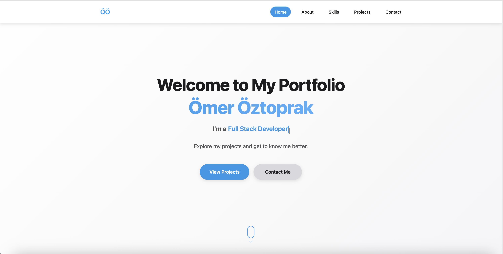
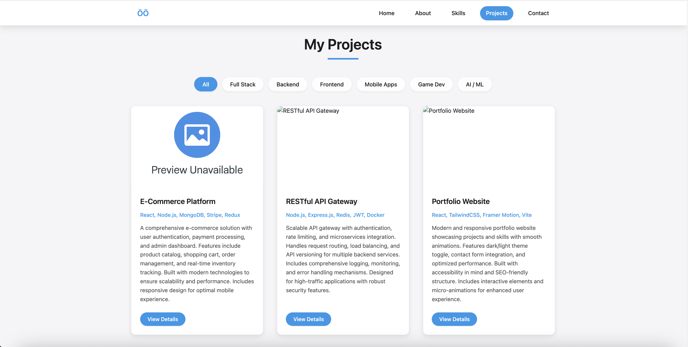

# Portfolio Cards Project

📋 **Overview**  
This project is a modern and responsive portfolio card system designed to showcase your software projects impressively. Users can filter projects by category, view details in modals, and browse through image galleries.

## 🔥 Project Preview

### Hero Section

*Clean and modern hero section with typewriter animation*

### Projects Gallery

*Interactive project cards with category filtering and smooth animations*


✨ **Features**
- **Responsive Card Design:** Optimized for perfect appearance on all screen sizes
- **Category Filtering:** Filter projects by fullstack, backend, frontend, mobile, game dev, or AI/ML
- **Pagination:** Supports pagination for large project collections
- **Detailed Modals:** Detailed modal view for each project with image galleries
- **Image Gallery:** Automatic slideshows and manual navigation for multiple images per project
- **URL Hash Navigation:** Link directly to specific projects
- **Accessibility:** ARIA labels and keyboard navigation support
- **Smooth Animations:** Beautiful transitions and hover effects
- **Mobile Optimized:** Touch-friendly interface for mobile devices

## 🚀 Installation and Usage

1. Clone this repository to your computer:
   ```bash
   git clone https://github.com/OmerOztprk/portfolio-website.git
   ```
2. Edit the [`cardsData.js`](js/cardsData.js) file with your own projects.
3. Add your project images to the `assets/images/` folder.
4. Update personal information in [`index.html`](index.html) (name, contact info, social links).
5. Customize colors and styling in [`style.css`](css/style.css) if desired.

To open the project in your browser:
- If using VS Code, open with the **Live Server** extension.
- Or use any local HTTP server.
- Simply open [`index.html`](index.html) in your browser (some features may require a server).

## 📁 Project Structure

```
portfolio-website/
├── assets/
│   ├── icon/
│   │   └── favicon.ico
│   ├── images/
│   │   ├── default.png
│   │   └── profile.png
│   └── pdf/
│       └── cv.pdf
├── css/
│   └── style.css        → Main stylesheet
├── js/
│   ├── script.js        → Main JavaScript application
│   └── cardsData.js     → Project data configuration
├── index.html           → Main HTML file
├── README.md           → Documentation
└── .gitignore          → Git ignore rules
```

## 🔧 Customization

### Edit Project Data
Customize your portfolio by editing the [`cardsData.js`](js/cardsData.js) file:

```javascript
export const cardsData = [
  {
    title: "Your Project Name",
    slug: "project-slug",
    tags: "React, Node.js, MongoDB",
    description: "Your project description...",
    category: "fullstack", // Options: fullstack, backend, frontend, mobile, game, ai
    images: [
      "./assets/images/project1.png",
      "./assets/images/project2.png"
    ],
    links: [
      { url: "https://demo-link.com", icon: "fas fa-play-circle" },
      { url: "https://github.com/username/repo", icon: "fab fa-github" }
    ]
  }
];
```

### Customize Categories
To modify the available filter categories:
1. Update filter buttons in [`index.html`](index.html) (Projects section)
2. Update category values in [`cardsData.js`](js/cardsData.js)
3. Ensure consistency between filter `data-filter` attributes and project categories

### Personal Information
Update the following in [`index.html`](index.html):
- Hero section: Name and profession
- About section: Bio, profile image, social links
- Contact section: Email and location
- Footer: Social media links

## 🎨 Styling

The project uses CSS custom properties (variables) for easy theming. Key variables in [`style.css`](css/style.css):

```css
:root {
  --primary-color: #2198e9;
  --primary-light: #6cb9ff;
  --primary-dark: #2878b3;
  --text-dark: #1d1d1f;
  --text-light: #515154;
  /* ... more variables */
}
```

## 💻 Technologies Used

- **HTML5** - Semantic markup with accessibility features
- **CSS3** - Modern styling with Grid, Flexbox, and CSS Variables
- **JavaScript (ES6+)** - Modular architecture with classes and modules
- **Font Awesome** - Icons for UI elements
- **Devicon** - Technology skill icons
- **Google Fonts** - Inter font family

## 🌟 Key Features Explained

### Advanced JavaScript Architecture
- **Modular Design**: Separate managers for cards, modals, navigation, and animations
- **State Management**: Centralized application state with timer management
- **DOM Utilities**: Cached DOM queries for better performance
- **Error Handling**: Graceful degradation and error recovery

### Accessibility Features
- **ARIA Labels**: Screen reader support throughout
- **Keyboard Navigation**: Full keyboard accessibility
- **Focus Management**: Proper focus trapping in modals
- **Color Contrast**: High contrast ratios for readability

### Performance Optimizations
- **Image Lazy Loading**: Images load only when needed
- **Debounced Events**: Optimized scroll and resize handlers
- **DOM Caching**: Reduced DOM queries for better performance
- **CSS Animations**: Hardware-accelerated transitions

## 📝 Configuration Notes

- **Recommended image size**: 840x480px for optimal display
- **Image formats**: PNG, JPG, WebP supported
- **Browser compatibility**: All modern browsers (Chrome, Firefox, Safari, Edge)
- **No backend required**: Pure frontend implementation
- **Mobile responsive**: Optimized for all device sizes

## 🔧 Development

### Running Locally
1. Clone the repository
2. Open with a local server (Live Server in VS Code recommended)
3. Edit [`cardsData.js`](js/cardsData.js) to add your projects
4. Customize styling in [`style.css`](css/style.css)

### Adding New Projects
1. Add project data to the [`cardsData`](js/cardsData.js) array
2. Place project images in `assets/images/`
3. Update image paths in the project data
4. Test the modal gallery functionality

## 📱 Browser Compatibility

- ✅ Chrome 80+
- ✅ Firefox 75+
- ✅ Safari 13+
- ✅ Edge 80+
- ✅ Mobile browsers (iOS Safari, Chrome Mobile)

## 🤝 Contributing

1. Fork the repository
2. Create a feature branch
3. Make your changes
4. Test thoroughly
5. Submit a pull request

## 📄 License

This project is not yet licensed. Please contact the author for usage rights.

---

**Built with ❤️ for developers who want to showcase their work beautifully.**

For questions, suggestions, or feedback, feel free to open an issue or reach out!
