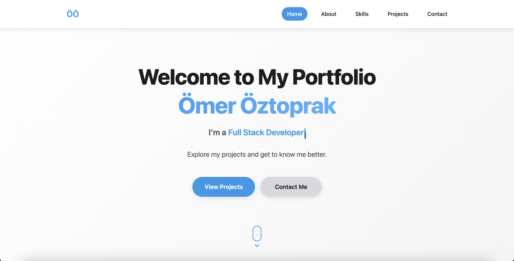
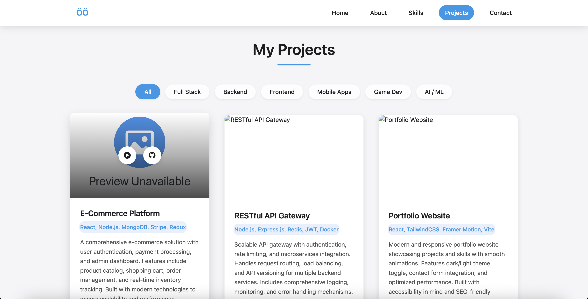

# Portfolio Website

A modern, responsive portfolio website built with HTML, CSS, and JavaScript. Features a clean design with smooth animations, project showcase, and interactive modals.

## Live Demo

Check out the live version: [https://omeroztprk.github.io/](https://omeroztprk.github.io/)

## Features

- **Responsive Design**: Works seamlessly across desktop, tablet, and mobile devices
- **Interactive Project Gallery**: Filter projects by category with pagination
- **Modal Gallery**: Detailed project view with image slideshow
- **Smooth Animations**: CSS animations and scroll reveal effects
- **Typewriter Effect**: Dynamic profession text animation
- **Modern UI**: Clean design with hover effects and transitions

## Screenshots

### Hero Section

*Modern hero section with typewriter effect and call-to-action buttons*

### Projects Gallery

*Interactive project showcase with filtering and modal gallery*

## Technologies Used

- HTML5
- CSS3 (Grid, Flexbox, Animations)
- JavaScript (ES6+)
- jQuery
- Font Awesome Icons
- Devicon

## Project Structure

```
portfolio-website/
├── index.html
├── css/
│   └── style.css
├── js/
│   ├── script.js
│   └── data/
│       ├── homeData.js
│       ├── aboutData.js
│       ├── skillsData.js
│       ├── cardsData.js
│       └── contactData.js
└── assets/
    ├── pdf/
    ├── icon/
    └── images/
        └── screenshots
```

## Getting Started

1. Clone the repository:
```bash
git clone https://github.com/OmerOztprk/portfolio-website.git
```

2. Navigate to the project directory:
```bash
cd portfolio-website
```

3. Open `index.html` in your browser or serve it using a local server:

## Customization

To customize the website with your own content:

1. **Personal Information**: Edit data files in `js/data/` directory
2. **Images**: Replace images in `assets/images/` with your own
3. **Resume**: Add your CV to `assets/pdf/cv.pdf`
4. **Styling**: Modify CSS variables in `css/style.css` for colors and spacing

## Browser Support

- Chrome (latest)
- Firefox (latest)
- Safari (latest)
- Edge (latest)

## Contributing

Feel free to submit issues and pull requests to improve the project.

## License

This project is licensed under the [MIT License](LICENSE).